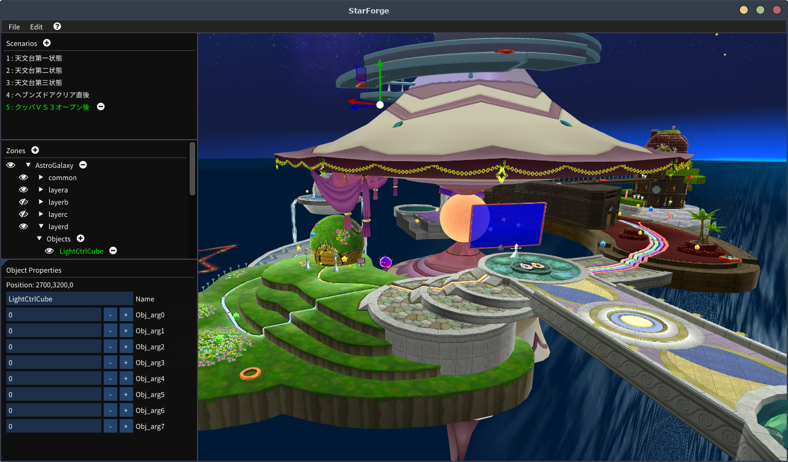

# StarForge

A WIP Map Editor for Super Mario Galaxy



## How to Use

Current StarForge requires a **Dolphin Root** (subject to change) or at the very least a root formatted in a similar way.

### Setting a Root

`Edit > Settings > Root Path Open`, Select your Dolphin Root's `DATA` folder containing `files` and `sys`. 

### Setting up the ObjectDB

Paste the URL for the ObjectDB json you wish to use in the settings menu's `ObjecDB` textbox and hit the update button. 


[Galaxy Database](https://github.com/SunakazeKun/galaxydatabase) is reccomended, and would use the following url:
`https://raw.githubusercontent.com/SunakazeKun/galaxydatabase/main/objectdb.json`


## Compiling

### Setup Repository

```
git clone https://github.com/Astral-C/StarForge.git

cd StarForge

git submodule update --init --recursive
```


### Linux

**Install the Iconv and CURL dev libraries for your system**.

```
cd StarForge
cmake -S. -Bbuild
cd build
make
```

### Windows

Install Visual Studio with the "Desktop Development with C++" component, make sure your installation has CMake and vcpkg set up.

Open the cloned reposity in Visual Studio, generate the build files with CMake, then you can compile and run the project.